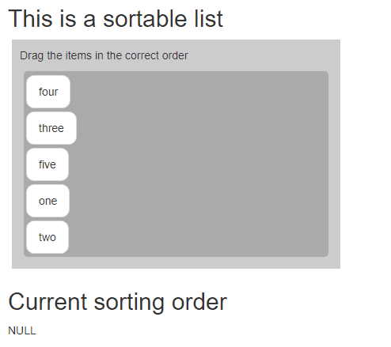

<!-- README.md is generated from README.Rmd. Please edit that file -->

```{r, include = FALSE}
knitr::opts_chunk$set(
  collapse = TRUE,
  comment = "#>",
  fig.path = "man/figures/README-",
  out.width = "100%"
)
```

# sortable

<!-- badges: start -->
[](https://travis-ci.org/rstudio/sortable)
[](https://cran.r-project.org/package=sortable)
[](http://www.rpackages.io/package/sortable)
[](https://codecov.io/gh/rstudio/sortable?branch=master)
<!-- badges: end -->

The `sortable` package enables drag-and-drop behaviour in your Shiny apps.  It does this by exposing the functionality of [`sortable.js`](https://sortablejs.github.io/Sortable/) as an [htmlwidget](https://htmlwidgets.org) in R, so you can use this in Shiny apps and widgets, `learnr` tutorials as well as R Markdown.


## Installation

~~You can install the released version of sortable from [CRAN](https://CRAN.R-project.org) with:~~

```r
~~install.packages("sortable")~~
```

And the development version from [GitHub](https://github.com/rstudio/sortable) with:

```r
# install.packages("remotes")
remotes::install_github("rstudio/sortable")
```

## Examples

### Simple example of a sortable list

```{r}
library(sortable)
```

It is easy to use `sortable` with `htmltools::tags`.  You can essentially make any HTML element sortable. The key idea is that the CSS id of the HTML element must match the `selector` argument of the `sortable` object:

```{r, eval=FALSE}
library(htmltools)

html_print(tagList(
  tags$p("This is a sortable list:"),
  tags$ul(
    id = "uniqueId01",
    tags$li("Move"),
    tags$li("Or drag"),
    tags$li("Each of the items"),
    tags$li("To different positions")
  ),
  sortable_js("uniqueId01") # use the id as the selector
))
```


### Sortable widgets

You can also use `sortable_js()` to drag and drop other widgets:

```{r, eval=FALSE}
library(DiagrammeR)
library(htmltools)

html_print(tagList(
  tags$p("You can drag and drop the diagrams to switch order:"),
  tags$div(
    id = "aUniqueId",
    tags$div(
      style = "border: solid 0.2em gray; float:left; margin: 5px",
      mermaid("graph LR; S[Sortable.js] -->|sortable| R ", height = 250, width = 300)
    ),
    tags$div(
      style = "border: solid 0.2em gray; float:left; margin: 5px",
      mermaid("graph TD; JavaScript -->|htmlwidgets| R ", height = 250, width = 150)
    )
  ),
  sortable_js("aUniqueId") # again, the CSS id must match the selector
))
```


### Using sortable in Shiny

It only works as an output right now, but of course I want it to be an input (*I'll try*) also.  Let's see it as an output.

```{r, eval=FALSE}
library(shiny)

ui <- shinyUI(fluidPage(
  fluidRow(
    column(
      width = 4,
      tags$h4("sortable in Shiny + Bootstrap"),
      tags$div(
        id = "veryUniqueId", class = "list-group",
        tags$div(class = "list-group-item", "Item 1"),
        tags$div(class = "list-group-item", "Item 2"),
        tags$div(class = "list-group-item", "Item 3")
      )
    )
  ),
  sortable_js("veryUniqueId")
))

server <- function(input, output) {}

shinyApp(ui = ui, server = server)
```


### Capturing input with `sortable_list()` inside a Shiny app

Now, let's see if we can get an idea what it might look like as an input or integral piece of Shiny.

```{r, eval=FALSE}
library(shiny)
library(sortable)

ui <- fluidPage(
  fluidRow(
    column(
      width = 6,
      tags$h2("This is a sortable list"),
      sortable_list(
        text = "Drag the items in the correct order",
        labels = sample(c("one", "two", "three", "four", "five")),
        input_id = "sortable_list_1"
      )
    )
  ),
  fluidRow(
    column(
      width = 6,
      tags$h2("Current sorting order"),
      textOutput("results")
    )
  )
)

server <- function(input, output) {
  output$results <- renderPrint({
    input$sortable_list_1 # This matches the input_id of the sortable list
  })
}


shinyApp(ui, server)

```



### Sortable tabsets

Or, check out these reorderable tabs by `runGist("2dbe45f77b65e28acab9")`.  All we had to do was add an `id` and add one line of code to the [Tabset example](https://github.com/rstudio/shiny-examples/tree/master/006-tabsets) from [RStudio](https://rstudio.com).  (You can find the [source code in this gist](https://gist.github.com/timelyportfolio/2dbe45f77b65e28acab9)).


