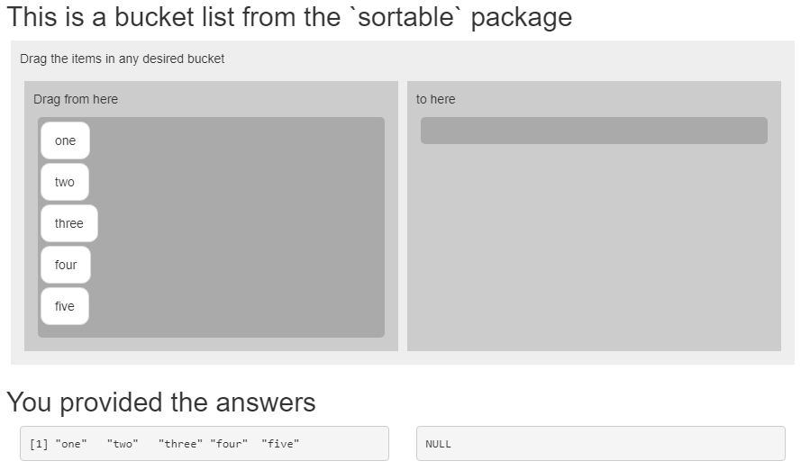
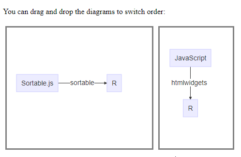

<!-- README.md is generated from README.Rmd. Please edit that file -->

# sortable 

<!-- badges: start -->

[](https://github.com/rstudio/sortable/actions)
[](https://cran.r-project.org/package=sortable)
[](http://www.rpackages.io/package/sortable)
[](https://codecov.io/gh/rstudio/sortable?branch=master)
[](https://www.tidyverse.org/lifecycle/#maturing)
[![RStudio Community:
Teaching](https://img.shields.io/badge/Community%20Support-Teaching-75aadb.svg?style=popout&logo=data:image/svg+xml;base64,PD94bWwgdmVyc2lvbj0iMS4wIiBlbmNvZGluZz0idXRmLTgiPz4KPCEtLSBHZW5lcmF0b3I6IEFkb2JlIElsbHVzdHJhdG9yIDIyLjEuMCwgU1ZHIEV4cG9ydCBQbHVnLUluIC4gU1ZHIFZlcnNpb246IDYuMDAgQnVpbGQgMCkgIC0tPgo8c3ZnIHZlcnNpb249IjEuMSIgeG1sbnM9Imh0dHA6Ly93d3cudzMub3JnLzIwMDAvc3ZnIiB4bWxuczp4bGluaz0iaHR0cDovL3d3dy53My5vcmcvMTk5OS94bGluayIgeD0iMHB4IiB5PSIwcHgiCgkgdmlld0JveD0iMCAwIDYyNS45IDYyNS45IiBzdHlsZT0iZW5hYmxlLWJhY2tncm91bmQ6bmV3IDAgMCA2MjUuOSA2MjUuOTsiIHhtbDpzcGFjZT0icHJlc2VydmUiPgo8c3R5bGUgdHlwZT0idGV4dC9jc3MiPgoJLnN0MHtmaWxsOiM3NUFBREI7fQoJLnN0MXtmaWxsOiM0RDRENEQ7fQoJLnN0MntmaWxsOiNGRkZGRkY7fQoJLnN0M3tmaWxsOnVybCgjU1ZHSURfMV8pO30KCS5zdDR7ZmlsbDp1cmwoI1NWR0lEXzJfKTt9Cgkuc3Q1e2ZpbGw6dXJsKCNTVkdJRF8zXyk7fQoJLnN0NntmaWxsOnVybCgjU1ZHSURfNF8pO30KCS5zdDd7ZmlsbDp1cmwoI1NWR0lEXzVfKTt9Cgkuc3Q4e2ZpbGw6dXJsKCNTVkdJRF82Xyk7fQoJLnN0OXtmaWxsOnVybCgjU1ZHSURfN18pO30KCS5zdDEwe2ZpbGw6dXJsKCNTVkdJRF84Xyk7fQoJLnN0MTF7ZmlsbDp1cmwoI1NWR0lEXzlfKTt9Cgkuc3QxMntmaWxsOnVybCgjU1ZHSURfMTBfKTt9Cgkuc3QxM3tvcGFjaXR5OjAuMTg7ZmlsbDp1cmwoI1NWR0lEXzExXyk7fQoJLnN0MTR7b3BhY2l0eTowLjM7fQo8L3N0eWxlPgo8ZyBpZD0iR3JheV9Mb2dvIj4KPC9nPgo8ZyBpZD0iQmxhY2tfTGV0dGVycyI+CjwvZz4KPGcgaWQ9IkJsdWVfR3JhZGllbnRfTGV0dGVycyI+Cgk8Zz4KCgkJCTxlbGxpcHNlIHRyYW5zZm9ybT0ibWF0cml4KDAuNzA3MSAtMC43MDcxIDAuNzA3MSAwLjcwNzEgLTEyNy45MjY1IDMxNy4wMzE3KSIgY2xhc3M9InN0MCIgY3g9IjMxOC43IiBjeT0iMzEyLjkiIHJ4PSIzMDkuOCIgcnk9IjMwOS44Ii8+CgkJPGc+CgkJCTxwYXRoIGNsYXNzPSJzdDIiIGQ9Ik00MjQuNyw0MTEuOGgzMy42djI2LjFoLTUxLjNMMzIyLDMxMC41aC00NS4zdjEwMS4zaDQ0LjN2MjYuMUgyMDkuNXYtMjYuMWgzOC4zVjE4Ny4zbC0zOC4zLTQuN3YtMjQuNwoJCQkJYzE0LjUsMy4zLDI3LjEsNS42LDQyLjksNS42YzIzLjgsMCw0OC4xLTUuNiw3MS45LTUuNmM0Ni4yLDAsODkuMSwyMSw4OS4xLDcyLjNjMCwzOS43LTIzLjgsNjQuOS02MC43LDc1LjZMNDI0LjcsNDExLjh6CgkJCQkgTTI3Ni43LDI4NS4zbDI0LjMsMC41YzU5LjMsMC45LDgyLjEtMjEuOSw4Mi4xLTUyLjNjMC0zNS41LTI1LjctNDkuNS01OC4zLTQ5LjVjLTE1LjQsMC0zMS4zLDEuNC00OC4xLDMuM1YyODUuM3oiLz4KCQk8L2c+Cgk8L2c+CjwvZz4KPGcgaWQ9IldoaXRlX0xldHRlcnMiPgo8L2c+CjxnIGlkPSJSX0JhbGwiPgo8L2c+Cjwvc3ZnPg==)](https://community.rstudio.com/c/teaching)
[![RStudio Ask a question:
sortable](https://img.shields.io/badge/Ask%20a%20question-sortable-75aadb.svg?style=popout&logo=data:image/svg+xml;base64,PHN2ZyB4bWxucz0iaHR0cDovL3d3dy53My5vcmcvMjAwMC9zdmciIHhtbG5zOnhsaW5rPSJodHRwOi8vd3d3LnczLm9yZy8xOTk5L3hsaW5rIiB2ZXJzaW9uPSIxLjEiIHg9IjBweCIgeT0iMHB4IiB2aWV3Qm94PSIwIDAgNjI1LjkgNjI1LjkiIHN0eWxlPSJlbmFibGUtYmFja2dyb3VuZDpuZXcgMCAwIDYyNS45IDYyNS45OyIgeG1sOnNwYWNlPSJwcmVzZXJ2ZSI+CjxzdHlsZSB0eXBlPSJ0ZXh0L2NzcyI+Cgkuc3Qwe2ZpbGw6Izc1QUFEQjt9Cgkuc3Qxe2ZpbGw6IzRENEQ0RDt9Cgkuc3Qye2ZpbGw6I0ZGRkZGRjt9Cgkuc3Qze2ZpbGw6dXJsKCNTVkdJRF8xXyk7fQoJLnN0NHtmaWxsOnVybCgjU1ZHSURfMl8pO30KCS5zdDV7ZmlsbDp1cmwoI1NWR0lEXzNfKTt9Cgkuc3Q2e2ZpbGw6dXJsKCNTVkdJRF80Xyk7fQoJLnN0N3tmaWxsOnVybCgjU1ZHSURfNV8pO30KCS5zdDh7ZmlsbDp1cmwoI1NWR0lEXzZfKTt9Cgkuc3Q5e2ZpbGw6dXJsKCNTVkdJRF83Xyk7fQoJLnN0MTB7ZmlsbDp1cmwoI1NWR0lEXzhfKTt9Cgkuc3QxMXtmaWxsOnVybCgjU1ZHSURfOV8pO30KCS5zdDEye2ZpbGw6dXJsKCNTVkdJRF8xMF8pO30KCS5zdDEze29wYWNpdHk6MC4xODtmaWxsOnVybCgjU1ZHSURfMTFfKTt9Cgkuc3QxNHtvcGFjaXR5OjAuMzt9Cjwvc3R5bGU+CjxnIGlkPSJHcmF5X0xvZ28iPgo8L2c+CjxnIGlkPSJCbGFja19MZXR0ZXJzIj4KPC9nPgo8ZyBpZD0iQmx1ZV9HcmFkaWVudF9MZXR0ZXJzIj4KCTxnPgoKCQkJPGVsbGlwc2UgdHJhbnNmb3JtPSJtYXRyaXgoMC43MDcxIC0wLjcwNzEgMC43MDcxIDAuNzA3MSAtMTI3LjkyNjUgMzE3LjAzMTcpIiBjbGFzcz0ic3QwIiBjeD0iMzE4LjciIGN5PSIzMTIuOSIgcng9IjMwOS44IiByeT0iMzA5LjgiLz4KCQk8Zz4KCQkJPHBhdGggY2xhc3M9InN0MiIgZD0iTTQyNC43LDQxMS44aDMzLjZ2MjYuMWgtNTEuM0wzMjIsMzEwLjVoLTQ1LjN2MTAxLjNoNDQuM3YyNi4xSDIwOS41di0yNi4xaDM4LjNWMTg3LjNsLTM4LjMtNC43di0yNC43ICAgICBjMTQuNSwzLjMsMjcuMSw1LjYsNDIuOSw1LjZjMjMuOCwwLDQ4LjEtNS42LDcxLjktNS42YzQ2LjIsMCw4OS4xLDIxLDg5LjEsNzIuM2MwLDM5LjctMjMuOCw2NC45LTYwLjcsNzUuNkw0MjQuNyw0MTEuOHogICAgICBNMjc2LjcsMjg1LjNsMjQuMywwLjVjNTkuMywwLjksODIuMS0yMS45LDgyLjEtNTIuM2MwLTM1LjUtMjUuNy00OS41LTU4LjMtNDkuNWMtMTUuNCwwLTMxLjMsMS40LTQ4LjEsMy4zVjI4NS4zeiIvPgoJCTwvZz4KCTwvZz4KPC9nPgo8ZyBpZD0iV2hpdGVfTGV0dGVycyI+CjwvZz4KPGcgaWQ9IlJfQmFsbCI+CjwvZz4KPC9zdmc+)](https://community.rstudio.com/new-topic?title=&category_id=13&tags=sortable&body=%0A%0A%0A%20%20--------%0A%20%20%0A%20%20%3Csup%3EReferred%20here%20by%20%60sortable%60%27s%20GitHub%3C/sup%3E%0A&u=barret)

<!-- badges: end -->

The `sortable` package enables drag-and-drop behaviour in your Shiny
apps. It does this by exposing the functionality of the
[SortableJS](https://sortablejs.github.io/Sortable/) JavaScript library
as an [htmlwidget](http://htmlwidgets.org) in R, so you can use this in
Shiny apps and widgets, `learnr` tutorials as well as R Markdown. In
addition, provides a custom `learnr` question type - `question_rank()`
that allows ranking questions with drag-and-drop.

## Installation

You can install the released version of sortable from
[CRAN](https://CRAN.R-project.org) with:

``` r
install.packages("sortable")
```

And the development version from
[GitHub](https://github.com/rstudio/sortable) with:

``` r
# install.packages("remotes")
remotes::install_github("rstudio/sortable")
```

## Examples

### Rank list

You can create a drag-and-drop input object in Shiny, using the
`rank_list()` function.

<center>

</img>

</center>

    #> Warning in file(con, "r"): file("") only supports open = "w+" and open = "w+b":
    #> using the former
    #> Warning in knitr::read_chunk(system.file("shiny-examples/rank_list/app.R", :
    #> code is empty

### Bucket list

With a bucket list you can have more than one rank lists in a single
object. This can be useful for bucketing tasks, e.g. asking your
students to classify objects into multiple categories.

<center>

</img>

</center>

    #> Warning in file(con, "r"): file("") only supports open = "w+" and open = "w+b":
    #> using the former
    #> Warning in knitr::read_chunk(system.file("shiny-examples/bucket_list/app.R", :
    #> code is empty

### Add drag-and-drop to any HTML element

You can also use `sortable_js()` to drag and drop other widgets:

<center>

</img>

</center>

``` r
library(DiagrammeR)
library(htmltools)

html_print(tagList(
  tags$p("You can drag and drop the diagrams to switch order:"),
  tags$div(
    id = "aUniqueId",
    tags$div(
      style = "border: solid 0.2em gray; float:left; margin: 5px",
      mermaid("graph LR; S[SortableJS] -->|sortable| R ",
              height = 250, width = 300)
    ),
    tags$div(
      style = "border: solid 0.2em gray; float:left; margin: 5px",
      mermaid("graph TD; JavaScript -->|htmlwidgets| R ",
              height = 250, width = 150)
    )
  ),
  sortable_js("aUniqueId") # the CSS id
))
```

## Related work

I learnt about the following related work after starting on `sortable`:

  - The `esquisse` [package](https://github.com/dreamRs/esquisse):
    
    > “The purpose of this add-in is to let you explore your data
    > quickly to extract the information they hold. You can only create
    > simple plots, you won’t be able to use custom scales and all the
    > power of ggplot2.”

  - There is also the `shinyjqui`
    [package](https://yang-tang.github.io/shinyjqui/):
    
    > “An R wrapper for jQuery UI javascript library. It allows user to
    > easily add interactions and animation effects to a shiny app.”

  - The `shinyDND`
    [package](https://cran.r-project.org/package=shinyDND):
    
    > Adds functionality to create drag and drop div elements in shiny.
