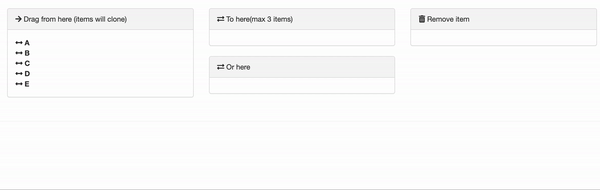

```{r, include = FALSE}
knitr::opts_chunk$set(
  collapse = TRUE,
  comment = "#>"
)
```


## Introduction

Sometimes you want the ability to drag an item **multiple times** from a list, in other words the ability to **"clone"** the items of the original list.

And you may also then want the ability to **remove** cloned items, possibly by dragging to a "bin" or "remove item" list.

</img>

### Cloning an element

To clone an element from a list, you must add the `pull = "clone"` option to the `sortable_options` argument::

```{r setup}
library(sortable)
```

```{r, eval=FALSE}
sortable_js(
  "sort1"
  options = sortable_options(
    group = list(
      pull = "clone",
      name = "sortGroup1",
      put = FALSE
    ),
    onSort = sortable_js_capture_input("sort_vars")
  )
)
```


### Removing an element

To remove an element from the dropped list, one option is to create a "bin" area by using the JavaScript code:

```js
this.el.removeChild(evt.item);
```

Then add to this JavaScript to the `onAdd` element of `sortable_options()`.  To pass your JavaScript code to R, use the `htmlwidgets::JS()` function:

```{r, eval=FALSE}
sortable_js(
  "sortable_bin",
  options = sortable_options(
    group = list(
      group = "sortGroup1",
      put = TRUE,
      pull = TRUE
    ),
    onAdd = htmlwidgets::JS("function (evt) { this.el.removeChild(evt.item); }")
  )
)
```


## Full example

And the full code:

```{r echo=FALSE, cache=FALSE}
knitr::read_chunk(
  system.file("shiny-examples/clone_remove/app.R", package = "sortable")
)
```


```{r shiny-clone-remove, eval=FALSE}
```
